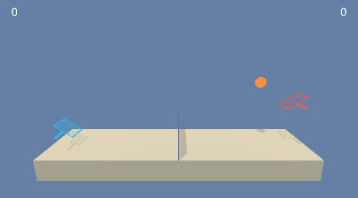

# Project 3: Collaboration and Competition

### Introduction

This project contains a solution to the third project of udacity Deep-Reinforcement-Learning nano-degree, which trains two agents to play with tennis. 

In this environment, two agents control rackets to bounce a ball over a net. If an agent hits the ball over the net, it receives a reward of +0.1.  If an agent lets a ball hit the ground or hits the ball out of bounds, it receives a reward of -0.01.  Thus, the goal of each agent is **to collaborate with each other** to keep the ball in play as long as possible.

The observation space consists of 8 variables corresponding to the position and velocity of the ball and racket. Two continuous actions are available, corresponding to movement toward (or away from) the net, and jumping. Each agent receives its own, local observation. **That means we can treat the two agents as one, and train one agent using the data from local observations, actions and rewards, then use it to play with itself.**

The task is episodic, and in order to solve the environment, the agents must get an average score of +0.5 (over 100 consecutive episodes, after taking the maximum over both agents). Specifically,

- After each episode, we add up the rewards that each agent received (without discounting), to get a score for each agent. This yields 2 (potentially different) scores. We then take the maximum of these 2 scores.
- This yields a single **score** for each episode.

The environment is considered solved, when the average (over 100 episodes) of those **scores** is at least +0.5.

### Getting Started

1. Clone the DRLND Repository and follow the instructions in the [DRLND GitHub repository](https://github.com/udacity/deep-reinforcement-learning) to set up your Python environment. 

2. Download the environment from one of the links below.  You need only select the environment that matches your operating system:
    - Linux: [click here](https://s3-us-west-1.amazonaws.com/udacity-drlnd/P3/Tennis/Tennis_Linux.zip)
    - Mac OSX: [click here](https://s3-us-west-1.amazonaws.com/udacity-drlnd/P3/Tennis/Tennis.app.zip)
    - Windows (32-bit): [click here](https://s3-us-west-1.amazonaws.com/udacity-drlnd/P3/Tennis/Tennis_Windows_x86.zip)
    - Windows (64-bit): [click here](https://s3-us-west-1.amazonaws.com/udacity-drlnd/P3/Tennis/Tennis_Windows_x86_64.zip)
    
3. Place the file in the DRLND GitHub repository, in the `p3_collab-compet/` folder, and unzip (or decompress) the file. 

### Instructions

Follow the instructions in `Tennis.ipynb` and run each cell.  
